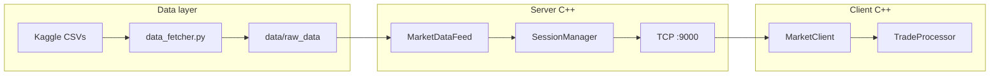

# UDS-OB-HFT

High-frequency **limit order book (LOB) replay** system in C++ with a TCP market-data server and a paper-trading client. Historical crypto LOB snapshots are loaded from the [Kaggle dataset](https://www.kaggle.com/datasets/martinsn/high-frequency-crypto-limit-order-book-data) (BTC, ETH, ADA) and streamed tick-by-tick to connected clients.

---

## Features

- **Server**: loads `*_1sec.csv` files, replays LOB updates over TCP (binary `UDSO` protocol)
- **Client**: subscribes to a symbol, runs a built-in paper-trading strategy on every tick
- **Python fetcher**: downloads CSVs via `kagglehub` into `data/raw_data/`
- **Launcher**: `./run.sh` builds, starts server + client, cleans up on exit

---

## Architecture



| Component | Role |
|-----------|------|
| `MarketDataFeed` | Parse CSV rows into `MarketSnapshot`, replay with timing |
| `SessionManager` | Accept clients, handle subscribe, broadcast updates |
| `MarketClient` | TCP I/O, decode packets, dispatch to strategy |
| `TradeProcessor` | Paper trading + session report (your logic lives here) |

---

## Project structure

```
UDS-OB-HFT/
├── common/           # Shared types, protocol, config
├── server/           # Replay server
├── client/           # TCP client + strategy
├── bin/scripts/python/
│   └── data_fetcher.py
├── run.sh              # One-command launcher
├── requirements.txt
└── CMakeLists.txt
```

---

## Prerequisites

- **C++20** compiler (Clang/GCC)
- **CMake** ≥ 3.16
- **Python 3.12+** (data download only)
- **Kaggle API** credentials: `~/.kaggle/kaggle.json` or `KAGGLE_USERNAME` / `KAGGLE_KEY`

---

## Quick start

```bash
# 1. Python env + data
python3 -m venv .venv
source .venv/bin/activate
pip install -r requirements.txt
python bin/scripts/python/data_fetcher.py

# 2. Build and run (server + client)
chmod +x run.sh
./run.sh
```

Fast replay (recommended for backtests):

```bash
UDS_LOOP=0 UDS_REPLAY_SPEED=100 ./run.sh
```

`run.sh` options: `--help`, `--symbol ETH`, `--fetch`, `--no-build`, `--server-only`, `--client-only`.

---

## Manual build

```bash
cmake -B build -S .
cmake --build build
```

Binaries: `build/server`, `build/client`.

**Terminal 1 — server**

```bash
./build/server
```

**Terminal 2 — client**

```bash
UDS_SYMBOL=BTC ./build/client
```

---

## Configuration

### Server

| Variable | Default | Description |
|----------|---------|-------------|
| `UDS_DATA_DIR` | `data/raw_data` | Directory with `BTC_1sec.csv`, etc. |
| `UDS_SERVER_PORT` | `9000` | TCP listen port |
| `UDS_REPLAY_SPEED` | `1.0` | Replay speed multiplier (`100` ≈ 100× faster) |
| `UDS_LOOP` | `1` | `1` = loop CSV replay; `0` = single pass |

### Client connection

| Variable | Default | Description |
|----------|---------|-------------|
| `UDS_SERVER_HOST` | `127.0.0.1` | Server hostname |
| `UDS_SERVER_PORT` | `9000` | Server port |
| `UDS_SYMBOL` | `BTC` | Symbol to subscribe: `BTC`, `ETH`, `ADA` |
| `UDS_LOG_INTERVAL` | `0` | Client progress log every N ticks (`0` = off) |

### Paper trading (simulation)

| Variable | Default | Description |
|----------|---------|-------------|
| `UDS_INITIAL_CASH` | `1000000` | Starting cash (USD) |
| `UDS_POSITION_SIZE` | `0.1` | Position size in BTC per trade |
| `UDS_SIGNAL_THRESHOLD` | `0.16` | Minimum composite score to enter |
| `UDS_FEE_RATE` | `0.000088` | Fee per open/close leg (~0.0088% notional) |
| `UDS_MIN_HOLD_TICKS` | `40` | Minimum seconds in position before exit/flip |
| `UDS_MAX_SPREAD` | `2.0` | Skip strategy ticks when spread is above this |
| `UDS_LOOKBACK_TICKS` | `5` | Fast momentum lookback (legacy env, strategy uses 5s/30s internally) |

Strategy-only constants (not env vars) live in `client/trade_processor.cpp` under `namespace strategy`.

---

## Built-in strategy

Executed on **every market tick** (~1 Hz — one CSV row per second).

**Signals**

- Fast momentum (5s) + slow momentum (30s)
- Order book imbalance (levels L0–L2)
- Buy/sell flow imbalance (`buys` / `sells`)

**Entry rules**

- All indicators must agree with direction
- Spread ≤ `0.05` (strategy filter)
- Long only if slow 30s momentum > **+0.05%**
- Short only if slow 30s momentum < **−0.05%**

**Risk / execution**

- Hysteresis exit (stay in trade while score stays above a low threshold)
- Stop-loss / take-profit on unrealized return
- Long ↔ short flip requires one **flat** tick in between
- Fees on each open and close leg

At the end of each replay, the client prints a **session report** (PnL, fees, trades, drawdown).

### Customize your strategy

Edit **`client/trade_processor.cpp`**:

- Strategy constants: `namespace strategy { ... }`
- Signal logic: `computeDesiredSide()`, `entryLongOk()`, `entryShortOk()`
- Optional: replace logic inside `runStrategy()` while keeping infrastructure in `MarketClient`

---

## Wire protocol (binary)

| Field | Value |
|-------|--------|
| Magic | `UDSO` (4 bytes) |
| Version | `1` |

| Message | Direction | Description |
|---------|-----------|-------------|
| `Welcome` | Server → Client | Available symbols |
| `Subscribe` | Client → Server | Subscribe to `BTC` / `ETH` / `ADA` |
| `MarketUpdate` | Server → Client | LOB snapshot (mid, spread, 5 levels) |
| `ReplayDone` | Server → Client | End of CSV replay for a symbol |
| `Heartbeat` | Both | Keep-alive |
| `Error` | Server → Client | Error string |

Packet layout: `PacketHeader` + payload (`common/protocol.hpp`).

---

## Dataset

Expected files after fetch:

```
data/raw_data/
├── BTC_1sec.csv
├── ETH_1sec.csv
└── ADA_1sec.csv
```

Key columns used by the server: `system_time`, `midpoint`, `spread`, `buys`, `sells`, and per-level `bids_*` / `asks_*` notional and distance fields (levels 0–4).

---

## License

Academic / personal project. Dataset subject to [Kaggle terms](https://www.kaggle.com/datasets/martinsn/high-frequency-crypto-limit-order-book-data).
